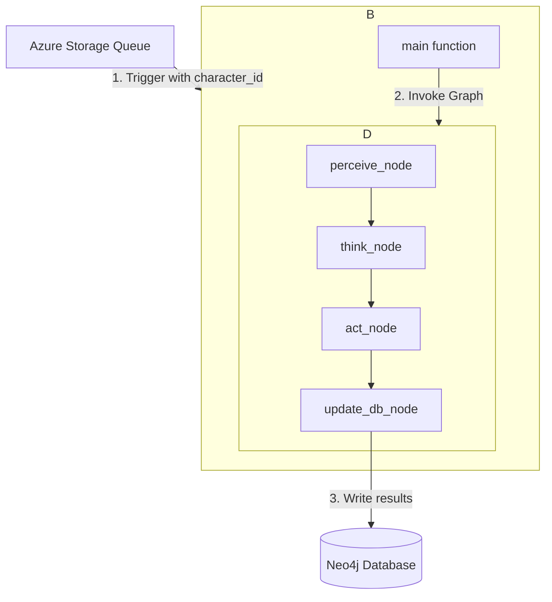

# 設計書: AI Character Action Cycle

## 1. アーキテクチャ概要

仕様書で定義されたAIキャラクターの行動サイクルは、Azure Functions (Python) 上で動作するLangGraph StateGraphとして実装する。全体の処理フローは以下の通り。



## 2. データモデル

グラフ内の状態管理には、`GEMINI.md`で定義済みの`CharacterState` TypedDictをそのまま利用する。これがグラフのノード間を流れる中心的なデータオブジェクトとなる。

```python
from typing import TypedDict, List, Dict, Optional

class RelationshipState(TypedDict):
    target_character_id: str
    affinity: float
    trust: float
    dominance: float
    tags: List[str]

class CharacterState(TypedDict):
    # ... (GEMINI.mdに記載の通り)
    character_id: str
    name: str
    personality: str
    background: str
    values: Dict[str, float]
    emotions: Dict[str, float]
    desires: Dict[str, float]
    timeline_context: List[Dict]
    world_event: Optional[str]
    relationships: List[RelationshipState]
    thought: Optional[str]
    action_content: Optional[str]
    database_updates: Optional[List[Dict]]
```

## 3. トリガー定義

この機能は外部APIではなく、Azure Storage Queueによってトリガーされる。

-   **トリガータイプ:** Azure Storage Queue Trigger
-   **キュー名:** `character-action-queue`
-   **メッセージスキーマ (JSON):**
    ```json
    {
      "character_id": "some-uuid-string"
    }
    ```

## 4. コンポーネント詳細

### 4.1. Azure Function (Python)

-   **責務:** キューメッセージを受け取り、LangGraphの実行を初期化・呼び出すエントリーポイント。
-   **実装:** `function_app.py` (または `__init__.py`) にキュー・トリガーのデコレーターを持つ関数を定義する。

### 4.2. LangGraph StateGraph

グラフは以下のノードで構成される。

-   **`perceive_node`**
    -   **入力:** `character_id`
    -   **責務:** Neo4jに接続し、キャラクターの静的情報、動的状態、関連するタイムラインコンテキスト（直近の投稿など）を取得し、`CharacterState`オブジェクトを構築して返す。

-   **`think_node`**
    -   **入力:** `CharacterState`
    -   **責務:** `CharacterState`の情報からLLMへのプロンプトを生成し、LLMを呼び出す。LLMは構造化されたJSON形式で「思考（thought）」と「行動内容（action_content）」を返すよう指示される。結果を`CharacterState`に格納して返す。

-   **`act_node`**
    -   **入力:** `CharacterState` (think_nodeの出力を含む)
    -   **責務:** `thought`と`action_content`を基に、Neo4jに新しい`Post`ノードを作成するためのデータと、キャラクターの感情・欲求などを更新するためのDB更新コマンドリスト (`database_updates`) を生成する。結果を`CharacterState`に格納して返す。

-   **`update_db_node`**
    -   **入力:** `CharacterState` (act_nodeの出力を含む)
    -   **責務:** `database_updates`に記録された全ての書き込み処理（Postノードの作成、Characterノードのプロパティ更新など）を、単一のトランザクション内で実行する。これによりデータの一貫性を保証する。

### 4.3. Neo4j Repository (Helper Module)

-   **責務:** 全てのCypherクエリをカプセル化する。`perceive_node`や`update_db_node`は、このリポジトリを経由してデータベースとやり取りする。
