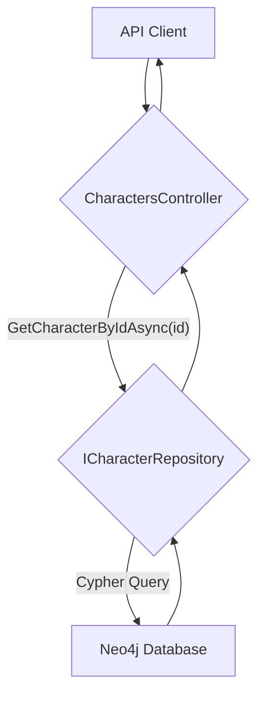

# 設計書: 特定キャラクター取得API

## 1. アーキテクチャ概要

既存の.NET Web APIのアーキテクチャを拡張し、特定のキャラクターを取得する機能を追加します。リクエストはコントローラー、リポジトリを経由してデータベースにアクセスします。



## 2. データモデル

既存の `Character` モデルをそのまま利用します。変更はありません。

```csharp
// backend.Models.Character
public class Character
{
    public string Id { get; set; } = Guid.NewGuid().ToString();
    public string? Name { get; set; }
    public string? LlmProvider { get; set; }
    public string? Personality { get; set; }
    public string? Background { get; set; }
    public Dictionary<string, float> Values { get; set; } = new();
    public Dictionary<string, float> Emotions { get; set; } = new();
    public Dictionary<string, float> Desires { get; set; } = new();
}
```

## 3. APIエンドポイント

- `GET /api/characters/{id}`
    - **説明:** 指定されたIDのキャラクター情報を取得する
    - **URLパラメータ:**
        - `id` (string, required): 取得対象のキャラクターID
    - **レスポンス:**
        - `200 OK`: `Character` オブジェクト
        - `404 Not Found`: キャラクターが存在しない場合

## 4. コンポーネント詳細

### a. `CharactersController.cs`

- `GET /api/characters/{id}` のHTTP GETリクエストを処理する新しいメソッド `GetCharacterById(string id)` を追加します。
- `ICharacterRepository` の `GetCharacterByIdAsync(id)` を呼び出し、結果を取得します。
- キャラクターが見つかった場合は `Ok(character)` (200) を、見つからなかった場合は `NotFound()` (404) を返却します。

### b. `ICharacterRepository.cs`

- `Task<Character?> GetCharacterByIdAsync(string id);` メソッドのシグネチャをインターフェースに追加します。

### c. `Neo4jCharacterRepository.cs`

- `GetCharacterByIdAsync(string id)` を実装します。
- 指定された `id` を持つ `:Character` ノードをNeo4jデータベースから検索するCypherクエリを実行します。
- ノードが見つかった場合は、`Character` オブジェクトにマッピングして返却します。
- ノードが見つからない場合は `null` を返却します。

